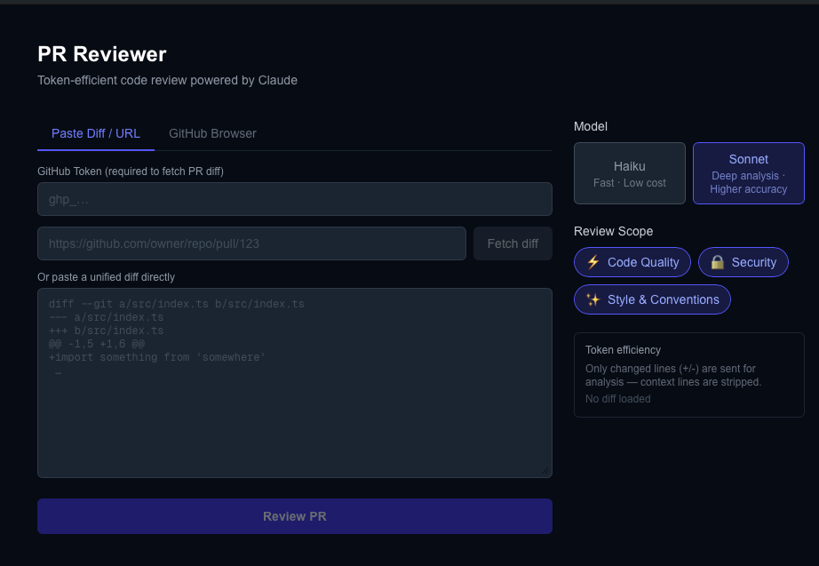

# PR Reviewer

An agentic web app that uses the **Claude API** to perform AI-powered pull request reviews. Supports two input modes — paste a diff or browse GitHub repos directly — with model switching and configurable review scope.



---

## Features

- **Two input modes**
  - **Paste Diff / URL** — paste a raw unified diff, or enter a GitHub PR URL to fetch the diff automatically
  - **GitHub Browser** — connect with a GitHub token to browse your repos and open PRs without leaving the app
- **Streaming reviews** — Claude's analysis streams token-by-token as it's generated
- **Model switching** — choose between Haiku (fast, low cost) and Sonnet (deeper analysis)
- **Configurable scope** — toggle Code Quality, Security, and Style & Conventions independently
- **Token-efficient by design** — only changed lines (`+`/`-`) are sent to Claude, not the full file context; the system prompt is cached across requests with matching scope

---

## Tech Stack

| Layer | Choice |
|---|---|
| Framework | Next.js 15 (App Router) |
| Language | TypeScript |
| Styling | Tailwind CSS |
| AI | Claude API via `@anthropic-ai/sdk` |
| Data | GitHub REST API (PAT auth) |
| State | React hooks — fully stateless, no database |

---

## Getting Started

### Prerequisites

- Node.js 18+
- An [Anthropic API key](https://console.anthropic.com/)
- A [GitHub Personal Access Token](https://github.com/settings/tokens) (for GitHub features — only `repo` scope needed)

### Installation

```bash
git clone https://github.com/worthbeer/pr-reviewer.git
cd pr-reviewer
npm install
```

### Environment

Create a `.env.local` file in the project root:

```bash
ANTHROPIC_API_KEY=sk-ant-your-key-here
```

The GitHub token is entered in the UI at runtime — it is never stored server-side or persisted anywhere.

### Run

```bash
npm run dev
```

Open [http://localhost:3000](http://localhost:3000).

---

## Usage

### Mode 1 — Paste a diff

1. Select the **Paste Diff / URL** tab (default)
2. Either:
   - Paste a unified diff directly into the textarea, **or**
   - Enter your GitHub token + a PR URL (`https://github.com/owner/repo/pull/123`) and click **Fetch diff**
3. Choose a **model** and **review scope** in the right panel
4. Click **Review PR** — the review streams in below the button

### Mode 2 — GitHub Browser

1. Select the **GitHub Browser** tab
2. Enter your GitHub Personal Access Token
3. Click **Load my repositories** to see your repos
4. Click a repo → click a PR → the diff is fetched automatically
5. The app switches to Paste mode with the diff pre-loaded — click **Review PR**

### Review output

Reviews are structured as:

- **Summary** — overall quality and risk level
- **Findings** — per-issue list with file/line reference, scope tag, and severity (🔴 Critical → ✅ Good)
- **Verdict** — Approve / Request Changes / Needs Discussion

---

## Architecture

```
app/
  page.tsx                  # Main UI (client component)
  api/
    review/route.ts         # POST — streams Claude review
    github/
      repos/route.ts        # GET  — list user repos
      prs/route.ts          # GET  — list open PRs for a repo
      diff/route.ts         # GET  — fetch PR diff (by URL or owner/repo/number)
components/
  ModelSwitcher.tsx         # Haiku / Sonnet selector
  ScopeToggles.tsx          # Code quality / security / style toggles
  ReviewPanel.tsx           # Streaming review output
  GitHubBrowser.tsx         # Repo + PR browsing UI
lib/
  claude.ts                 # Anthropic client, system prompt builder, diff trimmer
  github.ts                 # GitHub REST API helpers
types/
  index.ts                  # Shared TypeScript types
```

### Token efficiency

The `buildUserMessage` function in `lib/claude.ts` strips context lines before sending the diff to Claude — only `+`, `-`, `@@`, and `diff --git` header lines are included. This reduces input tokens significantly on large PRs.

The system prompt is marked with `cache_control: { type: "ephemeral" }`, so repeated reviews with the same scope selection benefit from Anthropic's prompt cache (~90% cost reduction on the cached portion after the first request).

### GitHub token handling

The token is sent from the browser to the Next.js API routes via an `x-github-token` request header. It is used server-side to call the GitHub REST API and is never logged or stored. Nothing leaves the server except the diff text (sent to Claude) and the structured response.

---

## Deployment

The app can be deployed to Vercel with one click:

1. Push to GitHub
2. Import the repo in [vercel.com](https://vercel.com)
3. Add `ANTHROPIC_API_KEY` as an environment variable in the Vercel project settings
4. Deploy

No database or external infrastructure required.

---

## Design decisions

**Why diff-only?** Sending full file contents for context would balloon token costs and latency. A well-formed unified diff contains all the information needed to evaluate a change. Context lines exist for human readability — Claude doesn't need them.

**Why no database?** Stateless architecture keeps the app simple and deployable anywhere. Reviews are ephemeral by design — this is a tool, not a review tracking system.

**Why Haiku vs Sonnet?** These represent the two ends of the cost/quality tradeoff for this task. Haiku is fast enough for a first-pass scan; Sonnet is worth the extra cost when a PR is high-risk or needs deep analysis. Exposing the choice to the user makes the tradeoff explicit.
